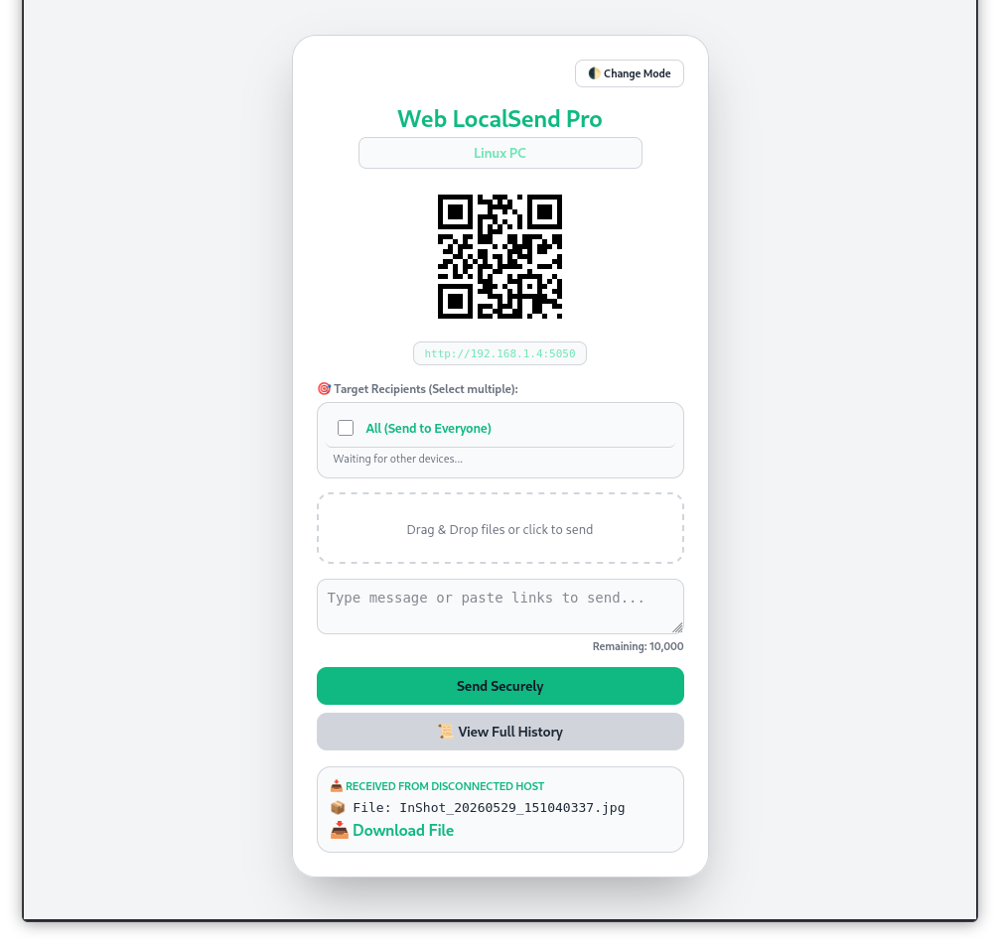

# 🚀 وب لوکال‌سند پرو (Web LocalSend Pro)

<p align="center">
  <a href="README.fa.md">🔴 <b>فارسی</b></a> | 
  <a href="README.md">🔵 <b>English</b></a>
</p>

یک ابزار تحت وب، سبک و فوق‌العاده سریع برای **انتقال امن فایل و متن** بین دستگاه‌های مختلف (ویندوز، لینوکس، اندروید و iOS) در یک شبکه محلی (Wi-Fi مشترک) بدون نیاز به اینترنت یا برنامه‌های جانبی.

___
<p align="center">
  
  
</p>
---

## ✨ ویژگی‌های کلیدی

* **امنیت و حریم خصوصی:** عدم باز کردن و پارس کردن فایل‌های متنی حساس (جلوگیری از نشت رمزها و اکسپلویت‌ها).
* **شمارشگر کاراکتر هوشمند:** دارای مکانیزم کنترل حجم متن و هشدار زنده برای سقف مجاز ۱۰,۰۰۰ کاراکتر.
* **اشتراک‌گذاری با QR Code:** تولید خودکار کدهای QR برای اتصال سریع گوشی‌ها به سرور محلی.
* **سیستم خاموشی خودکار (Heartbeat):** بسته‌شدن خودکار سرور در صورت بسته شدن یا کرش کردن مرورگر میزبان جهت حفظ امنیت سیستم.
* **نصب خودکار وابستگی‌ها:** اسکریپت به طور هوشمند پکیج‌های مورد نیاز را در اولین اجرا نصب می‌کند.
(`FastAPI`, `Uvicorn`)

---

## 🛠️ نحوه راه‌اندازی و اجرا

### ۱. پیش‌نیازها
برای اجرای این ابزار فقط کافیست `python 3` روی سیستم شما نصب باشد.

### ۲. اجرا روی سیستم میزبان
`ترمینال` یا `CMD` خود را در پوشه پروژه باز کرده و دستور زیر را تایپ کنید:

```bash
python localsend.py
